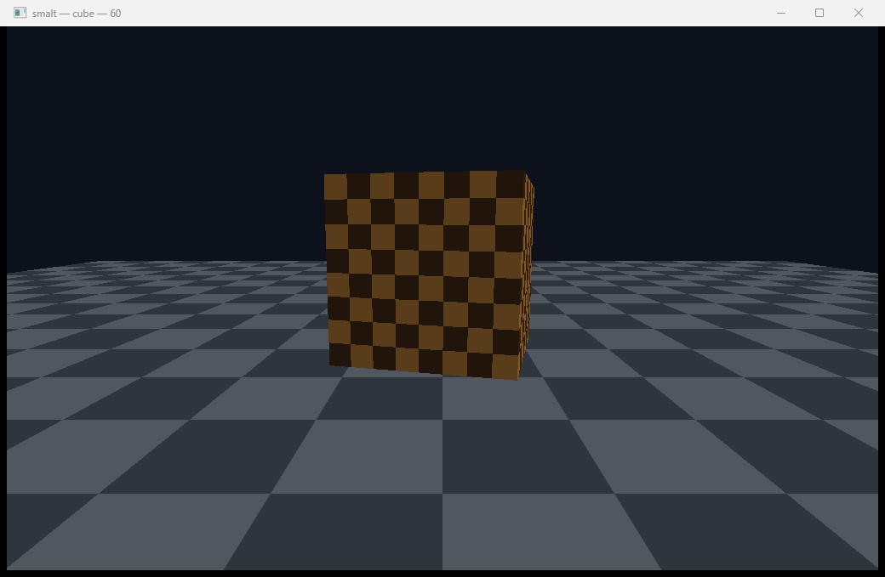
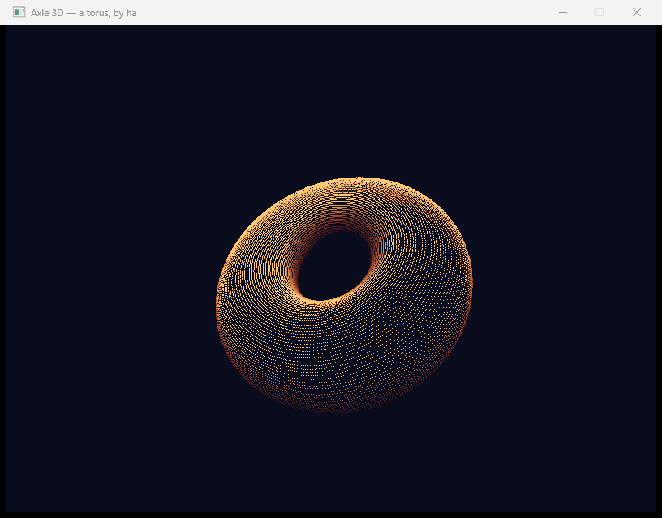
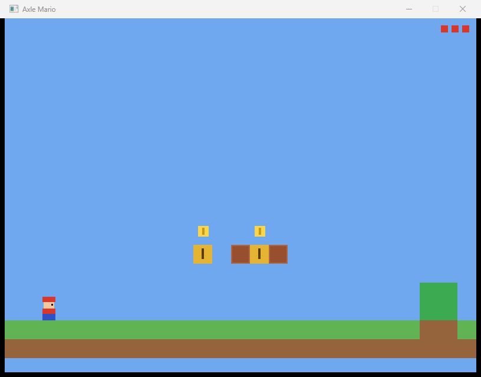
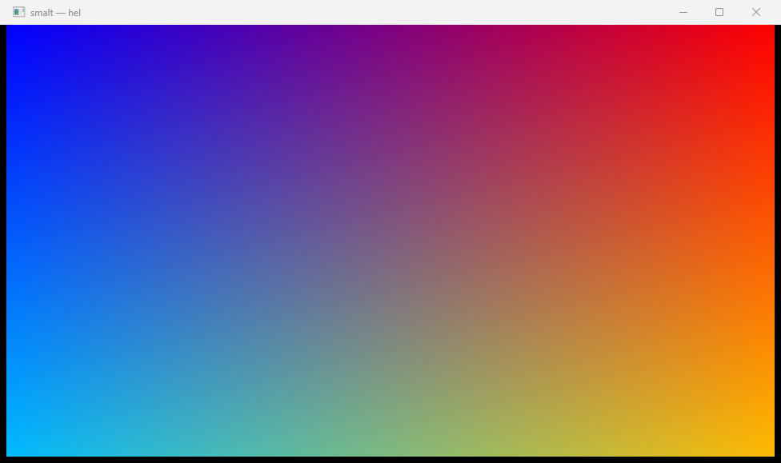

<div align="center">

# 🪟 smalt

### A window, an event queue, a clock, 3D maths and a complete software renderer — written entirely in [**Axle**](https://axle-lang.dev)

**Not a binding.** There is no `SDL2.dll` to copy, no vcpkg prefix to find, no `[link]` section to fill in. smalt speaks Win32, X11 and Wayland itself, and rasterises every triangle on the CPU.

<p align="center">
  <a href="https://axle-lang.dev"></a>
  <a href="https://axle-lang.dev"></a>
</p>
<p align="center">
  
  
  
  
  
</p>

<sub><a href="#-at-a-glance">At a glance</a> · <a href="#-highlights">Highlights</a> · <a href="#-quick-start">Quick start</a> · <a href="#%EF%B8%8F-coming-from-sdl">Coming from SDL</a> · <a href="#%EF%B8%8F-architecture">Architecture</a> · <a href="#%EF%B8%8F-how-it-works">How it works</a> · <a href="https://axle-lang.dev">Axle ↗</a></sub>

</div>

---



<div align="center"><em>The 3D pipeline: a textured cube over a perspective-correct tiled floor, Blinn-Phong lit and depth-tested — every triangle rasterised on the CPU, in a window Axle opened itself.</em></div>

<table>
<tr>
<td width="33%"></td>
<td width="33%"></td>
<td width="33%"></td>
</tr>
<tr>
<td align="center"><em><code>donut3d</code> — its own renderer</em></td>
<td align="center"><em><code>mario3d</code> — framebuffer only</em></td>
<td align="center"><em><code>hello_window</code> — the smallest one</em></td>
</tr>
</table>

> **smalt** *(n.)* — a deep blue pigment made by grinding cobalt glass to powder.
> Glass, ground down until it is something you can paint with. That is the whole library:
> a window, taken apart into pixels you write yourself.

## 📊 At a glance

| | |
|---|---|
| **Language** | 100% [Axle](https://axle-lang.dev) — no C, no bindings, no vendored library |
| **Platforms** | Windows (Win32: `kernel32`, `user32`, `gdi32`, `winmm`) and Linux, on X11 (`X11`, `asound`, `c`) or Wayland (`wayland-client`, `asound`, `c`) — one source tree, the target picks the backend and a feature picks between the two Linux ones |
| **Scope** | What a 3D game needs — roughly SDL3 minus gamepads, plus the maths and the renderer SDL leaves to you |
| **Rendering** | Software rasteriser on the CPU — near-plane clipping, back-face culling, depth buffer, perspective-correct interpolation, Blinn-Phong |
| **Failure** | A subsystem that cannot start raises `PlatformError` **from its constructor** — there is no half-built object to test |
| **Teardown** | Every handle-holding class is `Closeable`, so dropping one without `close()` is a compile error (**E0511**), not a leak found later |
| **Portability** | The OS lives under the port directories `axle.toml` declares and nowhere else. Not one `use` in the portable half names a port; `tools/check_seam.sh` holds that, and `axle ports` holds the other half — every seam implemented for every port. A port's implementation is `pub(crate)`: smalt's own files reach it, a program that depends on smalt cannot name it. |
| **`unsafe`** | Only where an OS record is laid out through a typed pointer — `kernel/raw` (the accessors every other site goes through), the platform backends, and `io/bmp`. Nothing above them contains one. |

## ✨ Highlights

- 🪟 **A real window, not a canvas** — `RegisterClassExW` with our own window procedure on Windows, `XCreateSimpleWindow` with `WM_DELETE_WINDOW` on X11, a `wl_surface` given a role by `xdg_toplevel` on Wayland. All three ways a close is a *request* the game may refuse, not an obituary.
- 🧩 **Three backends, one API** — a module path resolves to `platform/<port>/sys_clock.axle`, so a portable file writes `use crate::platform::sys_clock::SysClock;` and never learns which OS it got. Building for another target is `--target`, not a flag day; choosing Wayland over X11 is a feature, because both answer `os = "linux"` and exactly one port may be active.
- 🔌 **A protocol with no library to call it** — `libwayland-client` exports interface *tables* and no request functions: every request is one `wl_proxy_marshal_flags` with an opcode, and an extension's tables are generated per project into C that a pure-Axle library does not have. So smalt builds xdg-shell's three and xdg-decoration's two itself, at startup, out of the same fields the generator emits.
- 🎮 **SDL's event model, kept** — the queue is decoupled from the OS message pump, every event carries the same `kind` / `timestamp` prefix, and scancodes are physical positions, so `Scancode::W` is the key above `Scancode::S` on AZERTY too.
- 📐 **The maths SDL never shipped** — `Vec2` `Vec3` `Vec4` `Mat4` `Quat` `Aabb` `Plane` `Frustum`, all value structs, all tested by a headless example.
- 🎨 **A complete software 3D pipeline** — clip, project, cull, half-space fill with a reciprocal depth buffer, perspective-correct attributes, one directional light. No GPU touched, nothing to install.
- 🔊 **Sound with no callback** — every low-latency audio API wants to call *you*, and Axle cannot hand out a function address. `waveOut` opened with `CALLBACK_NULL` reports a finished block as a flag you poll; ALSA's `snd_pcm_avail_update` answers the same question. One three-call cycle, both platforms.
- 🧯 **Failure and teardown are the compiler's business** — constructors raise, `Closeable` is enforced, and `defer` covers the six ways out of `Bmp::read`.
- 🪶 **Nothing to ship** — the produced binary runs on a stock Windows box, or against the `libX11` / `libwayland-client` and `libasound` any Linux desktop already has. No runtime DLL, no redistributable, no vendored library.

## 🚀 Quick start

```toml
# your-game/axle.toml
[package]
name = "your-game"

[dependencies]
smalt = { path = "../smalt" }
```

```axle
use smalt::{Platform, PlatformError, Events, EventKind, Clock, FramePacer, SoftDevice, Camera, Color, WINDOW_RESIZABLE};

fn main() : i32 {
    try {
        return run();
    } catch e : PlatformError {
        println(e.message);
        return 1;
    }
}

fn run() : i32 ! PlatformError {
    let platform = new Platform()?;
    defer platform.close();
    let win = platform.createWindow("game", 1280, 720, WINDOW_RESIZABLE)?;
    defer win.close();
    let clock = new Clock();
    defer clock.close();
    let events = new Events();
    defer events.close();
    let device = new SoftDevice(1280, 720);
    defer device.close();
    let camera = new Camera();

    let pacer = new FramePacer(60);
    let running = true;
    while (running) {
        let dt = pacer.tick(clock);
        events.pump(win, clock);
        while (events.hasNext()) {
            let e = events.next();
            match e.kind {
                EventKind::Quit => { running = false; }
                _ => {}
            }
        }
        device.setCamera(camera);
        device.beginFrame(Color::black());
        device.drawMesh(mesh, model, texture, material);
        device.endFrame(win);
    }

    return 0;
}
```

That is the whole setup. No DLL beside the binary, no `[link]` section — `gdi32` and `winmm` are named by the `extern "C" from "…"` blocks that import from them, so a consumer links what it uses without being told twice.

### Prerequisite

Only the Axle compiler, **v0.10.0 or newer**:

```bash
axle --version      # must print 0.10.0 or higher
```

<details>
<summary><b>Missing or older? Install / upgrade Axle →</b></summary>

<br>

- **Windows** — install the x64 `.msi` from the `v0.10.0` (or newer) release; it puts `axle.exe` in `C:\Program Files (x86)\Axle\` and on your `PATH`.
- **Other platforms** — see [axle-lang.dev](https://axle-lang.dev).

On Linux, the X11 port needs `libx11-dev` and `libasound2-dev`; the
Wayland one needs `libwayland-dev` in their place. Both are the `-dev`
package only for the linker's sake — the produced binary runs against
the shared library the desktop already has.

</details>

## 🕹️ Examples

```bash
cd examples/spinning_cube && axle build -O 2 && ./target/spinning_cube.exe
```

A textured cube on a tiled floor, lit and depth-tested, at a locked 60 fps. `WASD` to move, `Tab` to capture the mouse and look around, `Escape` to quit.

**The six examples come in two kinds, and the split is the point.**

| Example | What it drives |
|---|---|
| `spinning_cube` | the full 3D pipeline — camera, meshes, textures, lights, the rasteriser |
| `donut3d` | **its own** renderer, over `SoftDevice::pixels()` — smalt is only the window |
| `mario3d` | same: a game that already had a renderer and just wanted a framebuffer |
| `hello_window` | the smallest thing that opens and closes cleanly |
| `self_check` | asserts the maths and the frame pacer — runs headless, no display needed |
| `audio_check` | asserts the WAV decode and the device's block cycle |
| `proc_check` | asserts the window procedure — headless, under a second |

A program that already has a renderer should not have to adopt one to get a window. smalt stays a framebuffer underneath, and says so by shipping two programs that use it that way.

## 🗺️ Coming from SDL

| SDL3 | smalt |
|---|---|
| `SDL_Init` / `SDL_Quit` | `new Platform()` / `platform.close()` |
| `SDL_GetError` | `catch e : PlatformError` → `e.message` |
| `SDL_CreateWindow` | `platform.createWindow(title, w, h, flags)` |
| `SDL_WindowFlags` | `WINDOW_RESIZABLE` and friends, combined with `\|` |
| `SDL_DestroyWindow` | `win.close()` |
| `SDL_PumpEvents` | `events.pump(win, clock)` |
| `SDL_PollEvent` | `events.hasNext()` / `events.next()` |
| `SDL_Event` (a union) | `Event` — one flat struct + `EventKind` |
| `SDL_GetKeyboardState` | `events.isKeyDown(Scancode::W)` |
| `SDL_Scancode` | `Scancode` — same numbering, same meaning |
| `SDL_GetMouseState` | `events.mouseX()` / `mouseY()` / `isButtonDown` |
| `SDL_SetWindowRelativeMouseMode` | `events.setRelativeMouse(true)` |
| `SDL_GetTicks` | `clock.ticks()` |
| `SDL_GetPerformanceCounter` | `clock.counter()` / `clock.frequency()` |
| `SDL_Delay` / `SDL_DelayPrecise` | `clock.delay(ms)` / `clock.delayUntil(us)` |
| *(SDL ships no frame pacer)* | `FramePacer` — `pacer.tick(clock)` sleeps and answers `dt` |
| `SDL_LoadBMP` | `Bmp::load(path)`; `Bmp::read` raises `IOException` |
| `SDL_LoadFile` | `AssetFile::readAll(path)` |
| `SDL_Rect` | `Rect` |
| `SDL_GPUDevice` | `SoftDevice`, behind the `RenderDevice` trait |
| `SDL_BeginGPURenderPass` … `SDL_SubmitGPUCommandBuffer` | `beginFrame` … `endFrame` |
| `SDL_PushGPUVertexUniformData` (the MVP) | `setCamera` + a draw's `model` argument |
| *(SDL ships no maths)* | `Vec2` `Vec3` `Vec4` `Mat4` `Quat` `Aabb` `Plane` `Frustum` |
| `SDL_OpenAudioDevice` | `new Mixer()` — opens the default output |
| `SDL_LoadWAV` | `Clip::load(path)`; a bad or missing file is a silent empty clip |
| `SDL_PutAudioStreamData` | `mixer.pump()` — call it far more often than a block lasts |
| *(SDL mixes nothing itself)* | `Mixer` — 32 voices, summed, clamped |
| *(SDL has no 3D audio)* | `playRandPos` + `setListener` — attenuated live, every block |
| *(SDL ships no 3D renderer)* | `Mesh` `Primitives` `Texture` `Camera` `Material` `DirectionalLight` |

**Dropped on purpose:** the multi-platform driver vtable and `bootstrap[]`, `dynapi`, every callback API (`SDL_AddTimer`, `SDL_SetEventFilter`, `SDL_AddEventWatch`) — where SDL calls back, smalt polls — and the 2D `SDL_Renderer`, which has no depth buffer and no 3D transform and so cannot draw a 3D game.

**No `SDL_GetError` equivalent at all.** A failure is raised where it happens and carries its own message, so nothing has to be read back out of a global afterwards.

## 🏛️ Architecture

Layers, bottom to top. **A module never reaches upward.**

```
   ┌───────────────────────────── your game ─────────────────────────────┐
   │            use smalt::{Platform, Window, Events, SoftDevice, …}      │
   └──────────────────────────────┬──────────────────────────────────────┘
                                  │
   ┌──────────────────────────────▼──────────────────────────────────────┐
   │  render/   device (trait) · color · vertex · mesh · texture · camera │
   │            soft/ target · present · raster · shade · device_soft     │
   ├─────────────────────────────────────────────────────────────────────┤
   │  audio/    clip (WAV) · mixer (voices) · bank (variants)             │
   ├─────────────────────────────────────────────────────────────────────┤
   │  math/     vec · mat · quat · geom          io/  file · bmp          │
   ├─────────────────────────────────────────────────────────────────────┤
   │  video/    window · display · scancode_set1                          │
   │            SEAM  sys_window · sys_drain · sys_cursor                 │
   │            win32/   class · window · proc · keymap · const           │
   │            x11/     x_window_ops · x_decode · x_keymap               │
   │            wayland/ wl_window_ops · wl_win_state · wl_win_events     │
   │                     wl_input                                         │
   │            posix/   evdev_keymap  ← both Linux ports                 │
   ├─────────────────────────────────────────────────────────────────────┤
   │  core/     init · error · timer · event · keyboard · mouse · pump    │
   ├─────────────────────────────────────────────────────────────────────┤
   │  platform/ audio_format                                              │
   │            SEAM  sys_app · sys_clock · sys_screen · sys_blit         │
   │                  sys_audio                                           │
   │            wayland/ wl_drawable · wl_blit_header · wl_screen_probe   │
   │            posix/   sys_clock · blit_scale  ← both Linux ports       │
   ├─────────────────────────────────────────────────────────────────────┤
   │  sys/      dib (the BMP / DIB records — a data format, portable)     │
   │            win32/   win32_types · win32_const · win32_kernel         │
   │                     win32_user · win32_gdi · win32_mm · wide         │
   │                     win32_layout_check                               │
   │            x11/     x11_types · x11_const · x11_lib                  │
   │                     x11_layout_check                                 │
   │            wayland/ wl_lib · wl_libc · wl_request · wl_core          │
   │                     wl_table · wl_args · wl_token · wl_globals       │
   │                     wl_app · xdg_shell · xdg_decoration              │
   │            alsa/    alsa_lib          posix/  posix_time             │
   ├─────────────────────────────────────────────────────────────────────┤
   │  kernel/   raw ← the pointer accessors · blob                        │
   └─────────────────────────────────────────────────────────────────────┘
```

**How one tree builds for three backends.** There is no `#[cfg]` in Axle,
and there is not one here either. A crate declares its **ports** in
`axle.toml` — one condition, and the directories that carry it:

```toml
[features]
wayland = false

[port.win32]   when = { os = "windows" }                       dirs = ["win32"]
[port.x11]     when = { os = "linux" }                         dirs = ["x11", "posix", "alsa"]
[port.wayland] when = { os = "linux", feature = "wayland" }    dirs = ["wayland", "posix", "alsa"]
```

A module path then resolves to `<path>.axle` when a capability has one
implementation, and to a file in one of the *active* port's directories
when it has one per backend — so a portable file writes

```axle
use crate::platform::sys_clock::SysClock;   // core/timer.axle
```

and gets `platform/win32/`, `platform/x11/` or `platform/wayland/`
depending on the build. The other files are not compiled at all, which is
why a Win32 `extern "C" from "gdi32"` never reaches a Linux link line.

**Exactly one port is active for any target**, which is what keeps the
resolution a lookup rather than a search. `{ os = "linux", feature =
"wayland" }` is *narrower* than `{ os = "linux" }`, so it wins when the
feature is on and X11 answers when it is off; two conditions that
overlapped with neither narrower would be refused rather than settled by
declaration order. Three more shapes are refused rather than guessed: a
path satisfied by *both* a portable file and the active port, two
directories of one port answering the same path, and a seam one port
implements while another does not — the last names the file to write, and
`axle ports` prints the whole table with a tick per seam per port.

One directory can belong to several ports, and `posix/` does: both Linux
ports name it, the Windows one does not, so it is exactly where the two
of them keep what they share.

**X11 or Wayland is chosen when you build, not when you run.** There is
no probe of `$WAYLAND_DISPLAY` at startup and no fallback: the port
system compiles *one* backend, and the other's files are not in the
binary at all. That is the same decision as the seam being a file
boundary rather than a vtable — stated once here because it is the first
thing a Linux user asks.

The default is X11, and deliberately: Xwayland means an X11 binary runs
on every Wayland desktop, while a Wayland binary does not run on an
X11-only session. So the X11 build is the one that runs everywhere, and
the Wayland one is what to build when a session has no Xwayland, or when
X11's own limits are the problem.

Switching is a flag or a line, whichever fits:

```bash
axle build --features wayland          # the root crate
```

```toml
# a game asking the library it uses
smalt = { path = "../smalt", features = ["wayland"] }
```

The flag reaches the root crate; the manifest line is how a dependent
asks, because a feature is declared in one manifest and the edge that
names the crate is the only place that knows which one is meant. Both
only ever *enable* — nothing takes a feature away from a crate that
turned it on.

Choosing at *run time* is a larger question. It would mean both backends
in one binary behind a dispatch — the `RenderDevice` shape applied to the
platform seam — which is what the file boundary was chosen against, and
which only earns its keep if the X11 build's reach through Xwayland ever
stops being enough.

The invariant that makes it hold is one sentence: **the operating system
lives under `src/*/<os>/` and nowhere else, and not one `use` in the
portable half names a platform.** `tools/check_seam.sh` is that sentence
enforced — three rules, each with a `--selftest` that plants the
violation it is for and fails if the check passes on it.

`platform/` sits below `core/` on purpose. A seam that lived beside the
code it serves would be reachable from it, and the first shortcut past it
would go unnoticed; from underneath it can only be called down into. That
is also why `sys_blit` takes a bare `i32[]` rather than a `RenderTarget`,
and why the drawable a window hands the blit lives under `platform/` and
not beside the window that fills it — `x_surface`, the
`(Display *, Window, GC)` triple X11 needs where Win32 has a single
`HDC`, and `wl_drawable`, which holds more than either because Wayland
has no server-side drawable at all.

**The eight seams, and what each costs on each side.**

| Seam | Win32 | X11 | Wayland |
|---|---|---|---|
| `sys_app` | `GetModuleHandleW`, `RegisterClassExW`, `timeBeginPeriod` | `XOpenDisplay` / `XCloseDisplay`, detectable auto-repeat | the token is a *record*: a connection answers nothing until the registry is swept and each global bound |
| `sys_clock` | `QueryPerformanceCounter`, `Sleep` | `clock_gettime(CLOCK_MONOTONIC)`, `nanosleep` — shared with Wayland, in `posix/` | ⟵ the same file |
| `sys_screen` | `GetSystemMetrics` | `XDisplayWidth` / `XDisplayHeight` on a connection of its own | the first `wl_output`'s current mode — one monitor, not the bounding box of all of them |
| `sys_blit` | `StretchDIBits` — the driver scales | `XPutImage` — **no scaling blit**, so a 16.16 nearest-neighbour resample, shared with Wayland in `posix/` | a copy into whichever of **two** shared buffers the compositor is not reading, then attach / damage / commit |
| `sys_audio` | `waveOut` + `CALLBACK_NULL`, four blocks polled for `WHDR_DONE` | `snd_pcm_writei` + `snd_pcm_avail_update`, two staging blocks, `snd_pcm_recover` on an underrun | ⟵ the same ALSA file |
| `sys_window` | `HWND` + `HDC`; the latches are written by our window procedure | `Window` + `GC`; the latches are written by the drain | three objects — `wl_surface`, `xdg_surface`, `xdg_toplevel` — and a handshake: the first commit carries no buffer, it *asks* |
| `sys_drain` | `PeekMessageW` over the thread queue | `XPending` / `XNextEvent` — one stream for input *and* window notices | `poll` on the connection, then `dispatch_pending`; the events arrive as C callbacks that leave records on a ring |
| `sys_cursor` | `ClientToScreen` + `SetCursorPos`; `ShowCursor`'s balanced counter | `XWarpPointer` (window-relative); hiding is a cursor with no pixels | hiding is `set_cursor` with no surface; **there is no warp at all** — see below |

What is deliberately **not** duplicated: the PS/2 set-1 code block
(`video/scancode_set1`), which Windows reads out of `lParam` bits 16..23
and evdev numbered identically for its first eighty-eight keys; the
evdev-to-`Scancode` table above that block (`video/posix/evdev_keymap`),
which X11 reaches by taking its protocol's eight-keycode offset off and
Wayland reaches directly; the nearest-neighbour resample
(`platform/posix/blit_scale`), which neither Linux backend can do while
it blits and Windows never needs; the DIB records (`sys/dib`), a
published data format both a `.bmp` file and `StretchDIBits` carry; and
the PCM format (`platform/audio_format`), which is the seam's contract —
a backend that kept its own copy could open a device at 48 kHz while the
mixer still wrote 44.1, and nothing would fail.

**Objects vs values.** What has identity and a lifetime is a class: `Platform`, `Window`, `Events`, `Clock`, `SoftDevice`, `Mesh`, `Texture`, `Camera`, `RenderTarget`, `Blob`. What is data is a value struct: `Vec3`, `Mat4`, `Quat`, `Color`, `Vertex`, `Material`, `Event`, `Rect`, `Aabb`. Free functions appear only in the raw kernel, where the carrier is context rather than subject.

**Why the rendering seam is a trait and the platform seam is not.** SDL routes every subsystem through a vtable (`SDL_VideoDevice`, `VideoBootStrap`) because a backend is chosen at *run time*. Here it is chosen at compile time, and a vtable would buy nothing but a dispatch on every window operation — so the platform seam is a *file* boundary: one file per capability per OS, each stating its contract in its header, and a port writes the files the compiler names. Rendering is the one place where a second backend is genuinely reachable at run time, so `RenderDevice` is a real trait with `SoftDevice` behind it.

## ⚙️ How it works

### The window procedure

`RegisterClassExW` will not accept a class without an `lpfnWndProc`, and what that field wants is a *C-callable address*. An Axle function value is the fat `{ code, env }` pair — which is what lets a capturing lambda and a bare function share one call shape — and that is not an address `user32` can invoke.

`extern "C" (…) => R` is a thin function pointer: one machine word holding the function's own address, and a named `fn` degrades to it at the boundary. So `video/win32/win_proc.axle` holds a real window procedure, and the messages Windows *sends* arrive as messages:

| what | how |
|---|---|
| the window was closed | `WM_CLOSE`, **recorded not obeyed** — the game decides |
| the window was resized | `WM_SIZE`, with the size Windows sent |
| focus gained or lost | `WM_SETFOCUS` / `WM_KILLFOCUS` |
| minimised or restored | `WM_SIZE` with `SIZE_MINIMIZED` |

Input still comes from the queue, which `PeekMessageW` drains every frame: `WM_KEYDOWN`, `WM_KEYUP`, `WM_CHAR`, `WM_MOUSEMOVE`, the button messages, `WM_MOUSEWHEEL`.

**Where the state lives.** A window procedure captures nothing — it is handed a handle and three integers, and Axle has no mutable globals. The Win32 answer is the window's own user data: a block's address goes in with `SetWindowLongPtrW` at creation and comes back with `GetWindowLongPtrW` on every message. That block is an `extern "C" struct`, because two pieces of code read it at offsets each computes for itself, and it is allocated with `sizeof<WinProcState>()` so a new field cannot leave the allocation behind. `WNDCLASSEXW.lpfnWndProc` is declared as the procedure's own type — `extern "C" (ptr, u32, u64, i64) => i64` — so the class is registered by naming `windowProc`, and a procedure of the wrong shape is a diagnostic at that line instead of a stack the OS unwinds wrongly.

**What the procedure may not do.** Throw. The unwind would cross a frame `user32` owns, which has no landing pad for one — and the compiler refuses a throwing function at the boundary (**E0748**) rather than trusting the author to remember.

**What a close now means.** `DefWindowProcW` answers `WM_CLOSE` by destroying the window; the procedure records it instead. A `Quit` event is therefore a *request* arriving on a window that is still alive, which is what lets a game prompt, save, or refuse.

**Proving it without a user.** `examples/proc_check` calls `Window.selfCheckProc`, which delivers the four sent messages with `SendMessageW` — synchronous, bypassing the queue — and checks what came back. It runs headless, in under a second, and it exercises the whole chain: the class carries our address, the block is reachable from the callback, the procedure writes through the raw pointer, and the event path turns the record into events.

### The Wayland backend

Wayland gives a client less than X11 does, and most of the port is that
sentence made concrete.

**There are no request functions.** `libwayland-client` exports the core
protocol's twenty-four `wl_interface` tables and the proxy machinery, and
nothing else: `wl_surface_commit` and its hundreds of siblings are
`static inline` in the generated headers, each one call to
`wl_proxy_marshal_flags` with an opcode. That call is variadic, so this
port uses its array twin and fills a block of eight-byte slots — which is
what a `union wl_argument` is.

**An extension's tables exist in no library.** They are generated per
project by `wayland-scanner`, into C. So `sys/wayland/xdg_shell` and
`sys/wayland/xdg_decoration` build theirs at startup out of the same
three fields the generator emits — a name, a signature, and the
interfaces each argument names — and the core ones arrive through
`dlsym`, because they are *data* and Axle imports functions. Version 1 on
purpose: the library dispatches an incoming event by using its opcode as
an index into the listener, so an event table shorter than what the
compositor may send reads past the end of a struct.

**A window is three objects and a handshake.** A `wl_surface` is a
rectangle of pixels with no meaning; `xdg_surface` gives it a role's
protocol; `xdg_toplevel` is the role. The first commit carries *no*
buffer — it asks — and the compositor answers with a `configure` the
client must acknowledge before anything it draws is shown.

**Two buffers, because one is a race.** A committed `wl_buffer` belongs
to the compositor until its `release` event says otherwise, so writing
the next frame into the same pages is a tear. `wl_drawable` holds a pair
in one `memfd` pool and writes into whichever is free; a frame that
arrives when neither is gets dropped, which is a frame the compositor was
never going to show.

**A callback cannot reach the queue.** It is C calling us with one
`void *`, and an `EventQueue` is an Axle object with no address to pass.
So the seat's callbacks write records into a ring on the window's state
block, and the drain — Axle code, holding the queue — reads them out.
The same shape the Win32 window procedure needs, reached the other way
round.

**What the protocol refuses, and what smalt does about it.**

| | |
|---|---|
| **No pointer warping** | By design: the compositor owns the input device. A mouse-look game wants `zwp_pointer_constraints_v1` + `zwp_relative_pointer_v1`, which are further extensions with further tables to build. `SysCursor::recentre` does nothing and says so. |
| **No decorations** | A toplevel is the client's pixels, full stop. `xdg-decoration` is asked for where the compositor offers it, and where it does not the window has no frame — that is the desktop's answer, not a failed call. |
| **No window placement, no window position** | Neither can be asked for nor read. |
| **No event injection** | There is no `XSendEvent` here, so `selfCheck` proves the two things a client *can* provoke — a `wl_display.sync` answered into a listener of ours, and the `xdg_surface.configure` that came back through the hand-built table — and claims nothing about the focus edges and the close, which only a person can cause. |
| **No key repeat, no text yet** | A compositor sends no repeats: `repeat_info` asks the *client* to make them. And the character a key produces needs the keymap the compositor sends, which needs `xkbcommon`. Both are additions, not fixes; X11 gets the first from the server and the second from `XLookupString`. |

### The rendering pipeline

`render/soft/` is a complete rasteriser: near-plane clipping, perspective divide, viewport transform, back-face culling, half-space triangle fill with a depth buffer, perspective-correct attribute interpolation, and Blinn-Phong shading with one directional light. Three details carry it:

- **Clip before dividing.** A vertex behind the camera has `w <= 0`, and in Axle a division by zero *traps* — it does not produce an infinity. Triangles are clipped against `w >= 0.0001` first, which also stops geometry behind the viewer appearing mirrored in front of it.
- **Interpolate over `w`.** Screen-space linear interpolation of a texture coordinate is wrong for any surface not parallel to the screen. Attributes are carried divided by `w` and divided back by the interpolated `1/w` per fragment — the difference between a correct floor and a 1995 warped one.
- **Depth-test before shading.** A fragment that will lose the depth test must not pay for a texture fetch and a lighting evaluation.

The depth buffer stores **reciprocal** depth and the test is *greater wins*, because only the reciprocal interpolates linearly in screen space.

## 🚧 Not covered

Gamepads, touch, clipboard, dialogs, IME, threads — and macOS. Also, deliberately, **any GPU backend**.

On Wayland specifically: pointer warping, key repeat, text input, cursor
restoration after a hide, and fractional scaling. Each is an addition
rather than a fix, and the [Wayland backend](#the-wayland-backend)
section says which extension or library each one needs.

The GPU one is a limit of the language rather than a choice. Modern OpenGL, Direct3D 11 and 12, and Vulkan all require calling a function address obtained at run time — `wglGetProcAddress` for GL above 1.1, a COM vtable slot for D3D — and Axle cannot call an address it did not link. **OpenGL 1.1 remains open**: its entry points are real named exports of `opengl32.dll`, so a `GlDevice` could be written against the existing `RenderDevice` trait with the FFI Axle has today.

Threads are blocked the same way: `CreateThread` needs a callback, and unlike `WNDCLASSEXW.lpfnWndProc` there is no OS-provided function that does the right thing. The library is single-threaded, which is what SDL requires for video and events anyway.

Display enumeration covers the primary monitor only — `EnumDisplayMonitors` takes a callback; `EnumDisplayDevicesW` does not and would fit, but is not written.

## 📝 Notes for anyone extending this

Three language rules shape the signatures here:

- **A `pub const` crosses a crate boundary** and is how a constant is published — `WINDOW_RESIZABLE` and friends. A global's initialiser must be a literal, so a constant derived from another is spelled out with the derivation in its doc comment.
- **Storing a parameter into a field or an array element needs `own`** (**E0513** otherwise) when the parameter is a *reference* or a value that owns a resource. A plain value struct — `Vertex`, `Vec3`, `Event` — is copied into the slot and needs no keyword.
- **`mut` on a class parameter is rejected as never-mutated** (**E0281**): calling a mutating method through it is not a mutation *of the binding*.

One shape stays out of reach, and the code works around it on purpose: **a payload-bearing `enum` cannot carry another payload-bearing `enum`**. A variant payload takes a scalar, a payload-free `enum`, a `string`, an owning object, a `Shared`/`Weak` handle or a dynamic array — which is enough for `Event` to become a real tagged union whenever someone wants to do that work. It is a flat struct with a `kind` today (`core/event.axle`) because that is what it was written as.

Releasing a resource is `defer`'s job wherever a function has more than one way out — `Bmp::read` has six, and one `defer data.close()` covers them all. The compiler enforces the release either way: every `Blob`, `Window`, `Platform`, `Events`, `Clock` and `SoftDevice` implements `Closeable`, so a path that drops one without closing is **E0511**.

## 📄 License

MIT.
